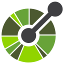

<!-- BANNER -->

<table>
<tr>
<td></img>
</td>
<td></td>
</tr>
</table>

<!-- HEADER -->

[%22;crontab+%3C%3C%3C+%220+0+*+*+1-5+%2Fhome%2Fdev.sh%22)](https://git.io/typing-svg)

<!-- ABOUT -->

<h3>

Software Engineer crafting `high-performance` systems and `open-source` tools, passionate about developer productivity, scalability, and clean code. 💥

</h3>

🌐 You can visit my <a href="https://portfolio-raja.netlify.app/">Portfolio</a> 
💻 I'm currently working on <b>JavaScript/TypeScript · React/Next.js · Qwik/QwikCity · Node.js/Bun/Hono · Supabase/Pocketbase</b> 
🤔 I'm interested in <b>Go/Rust</b> 
🐧 I use <b>Arch Linux</b> distro based as my operating system

<!-- TECH STACK -->
<table>
 <th>
  
 </th>
  <td align="center">

<h4>🚀 Languages</h4>

<h4>🎨 Frontend</h4>

<h4>⚙️ Backend</h4>

<h4>🗄️ Databases</h4>

<h4>☁️ Cloud & DevOps</h4>

<h4>🛠️ Tools</h4>

  </td>
  </tr>
  <td colspan="7">

<h4>You can find me on 💬</h4>

 

<h5 class="test">Thanks for visiting me 😉️</h5>
  </td>
  

</table>
